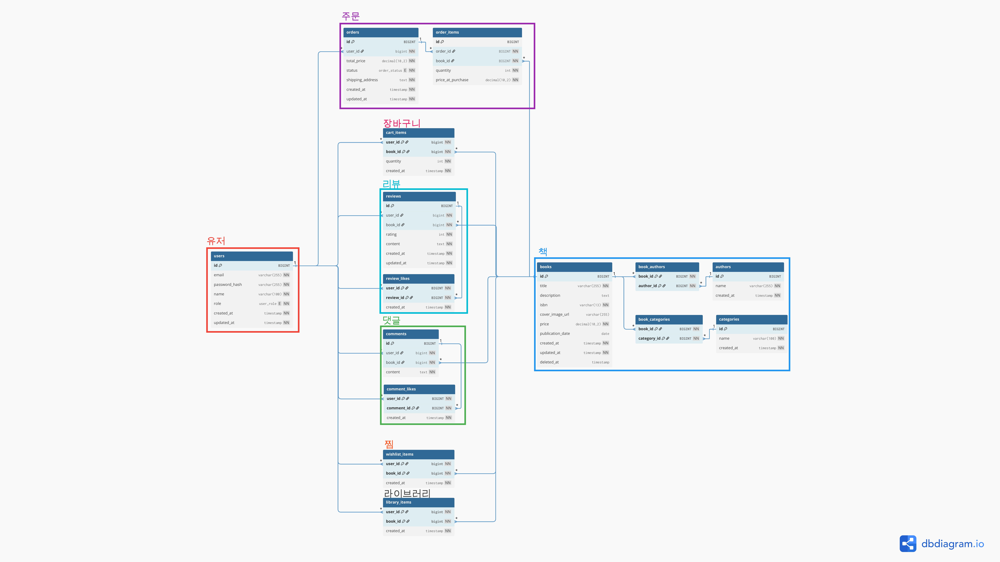

# WSD HW2 - 도서 관리 RESTful API 서버

전북대학교 웹 서비스 개발(WSD) Term Project - 도서 관리 RESTful API 서버


## 개발자 정보

- **학번**: 202117643
- **이름**: 최강림

---

## 프로젝트 개요

### 문제 정의
도서 정보를 관리하고, 사용자가 리뷰/댓글을 작성하며, 개인 서재 및 위시리스트를 관리할 수 있는 RESTful API 서버 구현

### 주요 기능

1. **인증/인가 시스템**
   - JWT 기반 Access Token + Refresh Token
   - Google OAuth 2.0 소셜 로그인
   - Firebase Authentication 연동
   - RBAC (Role-Based Access Control) - USER, ADMIN

2. **도서 관리 (CRUD)**
   - 도서 등록/조회/수정/삭제 (관리자 전용)
   - 페이지네이션, 카테고리 필터링, 정렬
   - ISBN 중복 검사
   - Soft Delete 적용

3. **리뷰 및 댓글 시스템**
   - 도서별 리뷰 작성/수정/삭제
   - 댓글 작성/수정/삭제
   - 좋아요 기능
   - Top-N 리뷰 조회 (좋아요 순)

4. **개인화 기능**
   - 내 서재 관리
   - 위시리스트 관리
   - 장바구니 기능

5. **보안 및 성능**
   - Redis 기반 토큰 블랙리스트
   - Refresh Token 저장소
   - N+1 쿼리 최적화 (joinedload)
   - Rate Limiting (API 호출 제한)

6. **문서화**
   - Swagger/OpenAPI 자동 생성
   - Postman 컬렉션 제공
   - 12종 이상 HTTP 상태 코드 지원

---

## 실행 방법

### 로컬 실행

```bash
# 1. 가상환경 생성 및 활성화
python3.11 -m venv .venv
.venv\Scripts\activate          # Windows
source .venv/bin/activate       # Linux/Mac

# 2. 의존성 설치
pip install -r requirements.txt

# 3. 환경변수 설정
cp .env.example .env
# .env 파일을 열어 실제 값으로 수정

# 4. Redis 실행 (Docker)
docker run -d --name redis -p 6379:6379 redis:7-alpine

# 5. DB 마이그레이션 및 시드 데이터 생성
alembic upgrade head
python scripts/seed.py

# 6. 서버 실행
uvicorn src.main:app --host 0.0.0.0 --port 8080 --reload
```

### Docker 실행 (권장)

```bash
# 1. Docker Compose로 전체 서비스 실행 (MariaDB, Redis, App)
docker-compose up -d --build

# 2. 로그 확인
docker-compose logs -f app

# 3. 컨테이너 중지
docker-compose down
```

#### Docker 서비스 구성

- **MariaDB 11.5**: 데이터베이스 (포트 3306)
- **Redis 7**: 캐시 및 토큰 저장소 (포트 6379)
- **FastAPI App**: 애플리케이션 서버 (포트 8080)

#### Health Check

모든 서비스는 health check를 통해 정상 구동을 확인합니다:
- MariaDB: `healthcheck.sh --connect --innodb_initialized`
- Redis: `redis-cli ping`
- App: MariaDB와 Redis가 정상 구동된 후 자동 시작

---

## 환경변수 설명

`.env.example` 참고:

### 기본 설정

| 변수명 | 설명 | 예시 |
|--------|------|------|
| `PORT_NUM` | 서버 포트 | `8080` |
| `DB_HOST` | MySQL 호스트 | `localhost` |
| `DB_PORT` | MySQL 포트 | `3306` |
| `DB_USER` | MySQL 사용자명 | `root` |
| `DB_PASSWORD` | MySQL 비밀번호 | `password` |
| `DB_NAME` | 데이터베이스명 | `wsd_db` |
| `SECRET_KEY` | JWT 서명 키 | `your-secret-key` |
| `ACCESS_TOKEN_EXPIRE_MINUTES` | Access Token 만료(분) | `60` |
| `REFRESH_TOKEN_EXPIRE_DAYS` | Refresh Token 만료(일) | `7` |
| `REDIS_HOST` | Redis 호스트 | `localhost` |
| `REDIS_PORT` | Redis 포트 | `6379` |
| `REDIS_DB` | Redis DB 번호 | `0` |

### 소셜 로그인 설정

#### Google OAuth 2.0

| 변수명 | 설명 | 획득 방법 |
|--------|------|-----------|
| `GOOGLE_CLIENT_ID` | Google OAuth 클라이언트 ID | [Google Cloud Console](https://console.cloud.google.com/) → API 및 서비스 → 사용자 인증 정보 |
| `GOOGLE_CLIENT_SECRET` | Google OAuth 클라이언트 비밀키 | 위와 동일 |
| `GOOGLE_REDIRECT_URI` | OAuth 콜백 URI | `http://localhost:8080/api/auth/google/callback` |

#### Firebase Authentication

| 변수명 | 설명 | 획득 방법 |
|--------|------|-----------|
| `FIREBASE_PROJECT_ID` | Firebase 프로젝트 ID | [Firebase Console](https://console.firebase.google.com/) → 프로젝트 설정 |
| `FIREBASE_PRIVATE_KEY` | Firebase Admin SDK Private Key | Firebase Console → 프로젝트 설정 → 서비스 계정 → 새 비공개 키 생성 |
| `FIREBASE_CLIENT_EMAIL` | Firebase Admin SDK Client Email | 위와 동일 (JSON 파일 내 client_email) |

---

## 배포 주소

| 항목 | URL |
|------|-----|
| **Base URL** | `http://113.198.66.75:10200/` |
| **Swagger UI** | `http://113.198.66.75:10200/docs` |
| **Health Check** | `http://113.198.66.75:10200/api/health` |

### 헬스체크 결과


---

## 예제 계정

| 역할 | 이메일 | 비밀번호 | 비고 |
|------|--------|----------|------|
| 일반 사용자 | `user1@example.com` | `P@ssw0rd!` | 기본 사용자 |
| 관리자 | `admin@example.com` | `P@ssw0rd!` | 도서 CRUD, 사용자 목록 조회 가능 |

> **주의**: 관리자 계정은 API를 통한 정보 수정/삭제가 불가합니다.

---

## DB 연결 정보 (테스트용)

| 항목 | 값 |
|------|-----|
| 호스트 | `localhost` |
| 포트 | `3306` |
| DB명 | `wsd_db` |
| 계정 | `root` / (설정된 비밀번호) |
| 권한 | 모든 테이블 읽기/쓰기 |

## DB ERD


---

## API 문서

### 엔드포인트 요약

- **총 37개** API 엔드포인트 구현
- Auth(6), Users(6), Books(5), Reviews(7), Comments(6), Library(3), Wishlist(3), System(1)

| 분류 | 주요 기능 | 엔드포인트 수 |
|------|-----------|---------------|
| **인증** | 로그인, 토큰 갱신, 로그아웃, Google OAuth, Firebase Auth | 6개 |
| **사용자** | 회원가입, 프로필 관리, 사용자 목록 (ADMIN) | 6개 |
| **도서** | CRUD (ADMIN), 목록 조회, 검색, 필터링 | 5개 |
| **리뷰** | CRUD, 좋아요, Top-N 조회 | 7개 |
| **댓글** | CRUD, 좋아요 | 6개 |
| **내 서재** | 도서 추가/삭제, 목록 조회 | 3개 |
| **위시리스트** | 도서 추가/삭제, 목록 조회 | 3개 |
| **시스템** | 헬스체크 | 1개 |

### 상세 문서

- **[API 설계 문서](docs/api-design.md)**: 전체 엔드포인트 상세, 요청/응답 형식, 에러 코드, 권한 매트릭스
- **[아키텍처 문서](docs/architecture.md)**: 시스템 구조, 계층 설계, 의존성, 데이터 흐름

### HTTP 상태 코드

12종 이상의 HTTP 상태 코드를 사용합니다:
- **2xx**: 200 (OK), 201 (Created), 204 (No Content)
- **3xx**: 307 (Temporary Redirect)
- **4xx**: 400 (Bad Request), 401 (Unauthorized), 403 (Forbidden), 404 (Not Found), 409 (Conflict), 422 (Unprocessable Entity), 429 (Too Many Requests)
- **5xx**: 500 (Internal Server Error)

상세 설명은 [API 설계 문서](docs/api-design.md#http-상태-코드-12종-이상)를 참고하세요.

---

## postman 스크립트
 | 스크립트 | 요청        | 기능                                  |
  |----------|-------------|---------------------------------------|
  | ①        | 로그인      | 토큰 저장 (bearerToken, refreshToken) |
  | ②        | 토큰 재발급 | 새 bearerToken 저장                   |
  | ③        | 도서 목록   | 응답 검증 + bookId 저장               |
  | ④        | 도서 상세   | 응답 검증                             |
  | ⑤        | 내 정보     | 인증 토큰 검증                        |
  | ⑥        | 로그아웃    | 토큰 초기화                           |

---

## 성능/보안 고려사항

### 보안
- [o] 비밀번호 bcrypt 해싱
- [o] JWT 토큰 인증
- [o] Refresh Token Redis 저장
- [o] Access Token 블랙리스트 관리
- [o] 환경변수로 민감정보 관리
- [o] CORS 설정 (허용 도메인 명시)

### 성능
- [o] 레이트리밋 (분당 60회)
- [o] N+1 쿼리 방지 (joinedload)
- [o] 페이지네이션 적용
- [o] 인덱스 설정 (외래키)

---

## 테스트

### 테스트 실행

**사전 준비:**

```bash
# 1. 로컬 MariaDB 컨테이너 실행
docker-compose up -d mysql

# 2. 테스트용 DB 생성
docker exec -it wsd_mariadb mariadb -uroot -p[비밀번호] -e "CREATE DATABASE IF NOT EXISTS test_wsd_db CHARACTER SET utf8mb4 COLLATE utf8mb4_unicode_ci;"
```

**테스트 실행:**

```bash
# 전체 테스트 실행 (25개 테스트)
python -m pytest tests/ -v

# 특정 테스트 파일 실행
python -m pytest tests/test_auth.py -v
python -m pytest tests/test_users.py -v
python -m pytest tests/test_books.py -v
python -m pytest tests/test_reviews.py -v
```

### 테스트 구성

| 파일 | 테스트 수 | 설명 |
|------|-----------|------|
| `tests/test_auth.py` | 6 | 로그인, 토큰 재발급, 로그아웃 테스트 |
| `tests/test_users.py` | 6 | 회원가입, 프로필 조회/수정 테스트 |
| `tests/test_books.py` | 8 | 도서 CRUD 테스트 (등록, 조회, 수정, 삭제) |
| `tests/test_reviews.py` | 5 | 리뷰 작성, 조회, 수정, 삭제 테스트 |
| **총합** | **25** | **20개 이상 요구사항 충족 ✅** |

### 테스트 환경

- **DB**: MariaDB 11.5 (로컬 테스트 전용 DB, 프로덕션 DB와 격리)
- **Fixture**: 테스트용 사용자, 관리자, 도서 자동 생성
- **Client**: FastAPI TestClient 사용
- **비동기 지원**: pytest-asyncio

---

## 한계와 개선 계획

### 현재 한계
1. 통계 API: 일별 통계, 인기 작성자 등 미구현
2. 장바구니/주문: 모델만 존재, API 미구현
3. 이미지 업로드: URL만 저장, 실제 업로드 미지원

### 개선 계획
1. 통계 API 구현
2. 장바구니/주문 결제 플로우 구현
3. S3 연동 이미지 업로드

---

## 기술 스택

| 분류 | 기술 |
|------|------|
| **Backend** | Python 3.11, FastAPI, SQLAlchemy 2.0, Alembic, Pydantic V2 |
| **Database** | MariaDB 11.5, Redis 7 |
| **Authentication** | JWT (python-jose), bcrypt, authlib (Google OAuth), firebase-admin |
| **Infrastructure** | Docker 24.0+, Docker Compose 2.0+, Uvicorn (ASGI) |
| **Testing** | pytest, pytest-asyncio, httpx |
| **Documentation** | Swagger/OpenAPI (자동 생성), Postman |

**상세 정보**: [아키텍처 문서](docs/architecture.md)에서 계층 구조, 모듈 의존성, 데이터 흐름을 확인하세요.

